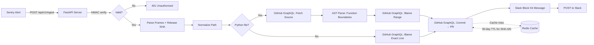

# Stacktrace-to-PR Time Machine

[](https://python.org)
[](https://fastapi.tiangolo.com)
[](https://redis.io)
[]()
[](https://opensource.org/licenses/MIT)

> Webhook-driven service that traces Sentry stack frames to the exact Pull Request that introduced the bug via GitHub GraphQL blame API — posts enriched incident context to Slack in seconds.

## Why I Built This

On-call engineers waste **15-30 minutes per incident** doing the same manual trace: open Sentry → find the error line → `git blame` → find the commit → find the PR → copy context into Slack. This tool does all of that in **under 3 seconds**, automatically, the moment Sentry fires.

## Technical Highlights

- **Fully stateless** — zero local git clones. All blame, file content, and PR data via GitHub GraphQL API
- **AST-aware blame** — Python files get `ast.parse()` to find full function boundaries, then blame the entire range (not just the error line)
- **SHA-aware caching** — immutable SHA queries cached 30 days (commits never change), mutable branch queries use short TTLs
- **HMAC-SHA256 verification** with constant-time `compare_digest()` preventing forged payloads AND timing attacks
- **Graceful degradation** — partial failures still produce useful Slack messages

## Architecture



## Key Design Decisions

- **Fully stateless** — No local git clones. All blame, file content, and PR data fetched via GitHub GraphQL API.
- **Release SHA pinning** — Queries the exact deployed commit, not `main`, preventing line-number drift.
- **Multi-language support** — Python files get function-boundary AST analysis. All other languages fall back to exact-line blame.
- **SHA-aware caching** — Immutable SHA-based queries cached for 30 days. Mutable branch queries use short TTLs.
- **Sentry HMAC verification** — Validates webhook signatures to prevent fake payload abuse.
- **Graceful degradation** — Partial pipeline failures still produce useful Slack messages with available data.

## Quick Start

### Prerequisites

- Docker and Docker Compose
- GitHub Personal Access Token (with `repo` scope)
- Sentry project with webhook configured
- Slack incoming webhook URL

### Setup

1. Clone and configure:
   ```bash
   cd stacktrace-time-machine
   cp .env.example .env
   # Edit .env with your tokens and settings
   ```

2. Start the service:
   ```bash
   docker compose up -d
   # Docker Compose v1:
   # docker-compose up -d
   ```

3. Verify it's running:
   ```bash
   curl http://localhost:8000/health
   ```

### Configure Sentry Webhook

1. In Sentry, go to **Settings → Developer Settings → Custom Integrations**
2. Create a new integration with webhook URL: `https://your-host/api/v1/ingest`
3. Enable **Issue Alerts** as the event type
4. Copy the **Client Secret** to your `.env` as `SENTRY_CLIENT_SECRET`

## API Endpoints

### POST /api/v1/ingest

Receives Sentry issue alert webhooks and runs the full blame → PR → Slack pipeline.

**Headers:**
- `sentry-hook-signature` — HMAC-SHA256 signature
- `Content-Type: application/json`

**Responses:**
- `200 OK` — Processed (even with partial failures)
- `401 Unauthorized` — Invalid signature
- `422 Unprocessable Entity` — Malformed payload

### GET /health

Health check with Redis connectivity status.

```json
{
  "status": "healthy",
  "version": "1.0.0",
  "redis_connected": true,
  "uptime_seconds": 3600.5
}
```

## Environment Variables

| Variable | Required | Default | Description |
|----------|----------|---------|-------------|
| `GITHUB_TOKEN` | Yes | — | GitHub PAT with `repo` scope |
| `SENTRY_CLIENT_SECRET` | Yes | — | Sentry webhook signing secret |
| `SLACK_WEBHOOK_URL` | Yes | — | Slack incoming webhook URL |
| `REDIS_URL` | No | `redis://localhost:6379` | Redis connection URL |
| `REPO_MAP` | Yes | — | `slug:owner/repo` mappings (comma-separated) |
| `PATH_STRIP_PREFIX` | No | `""` | Container path prefix to strip |
| `DEFAULT_BRANCH` | No | `main` | Fallback when release SHA is missing |
| `PORT` | No | `8000` | Server port |
| `LOG_LEVEL` | No | `INFO` | Logging level |

## Development

### Running Tests

```bash
pip install -r requirements.txt
pytest tests/ -v
```

### Project Structure

```
src/
  server.py           # FastAPI webhook endpoint + pipeline orchestration
  schemas.py          # Pydantic data models
  config.py           # Environment variable settings
  exceptions.py       # Custom exception hierarchy
  analyzer.py         # AST parsing (Python) + language gate
  github_client.py    # GitHub GraphQL client (file content, blame, PR)
  slack_notifier.py   # Slack Block Kit message builder
  cache.py            # Redis caching with SHA-aware TTLs
  webhook_auth.py     # Sentry HMAC signature verification
  logging_config.py   # Structured JSON logging
tests/
  test_analyzer.py    # 28 tests: payload parsing, AST, language gate
  test_github_client.py  # 11 tests: GraphQL mocking, rate limits
  test_slack_notifier.py # 11 tests: Block Kit rendering, partial data
  test_webhook_auth.py   # 5 tests: HMAC verification
  test_server.py      # 9 tests: integration pipeline tests
```

## How It Works

1. **Sentry fires a webhook** when an error alert triggers
2. **HMAC verification** ensures the payload is authentic
3. **Frame extraction** pulls the top in-app stack frame and the release SHA
4. **Path normalization** converts container paths (`/usr/src/app/src/handler.py`) to Git paths (`src/handler.py`)
5. **Language gate** checks the file extension:
   - **Python**: Fetches source via GraphQL, runs `ast.parse()` to find the full function definition (lines 26-35), then blames the entire function range
   - **Non-Python**: Blames the exact error line only
6. **Git blame via GraphQL** identifies the most recent commit that modified those lines
7. **PR lookup** maps the commit SHA to its associated Pull Request, fetching title, description, author, and review comments
8. **Slack notification** posts a rich Block Kit message with all the context an on-call engineer needs
