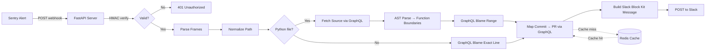

# Stacktrace-to-PR Time Machine — Specification

## Overview

A webhook-driven FastAPI service that ingests Sentry stack traces, traces them back through Git history via the GitHub GraphQL API to the exact Pull Request that introduced the faulty code, and posts enriched incident context to Slack within seconds of an alert firing.

## Architecture



## API Contract

### POST /api/v1/ingest

Receives a Sentry issue alert webhook.

**Headers:**
- `sentry-hook-signature` — HMAC-SHA256 signature of the request body
- `Content-Type: application/json`

**Request Body:** Sentry webhook payload (see Sentry documentation for schema)

**Response:**
- `200 OK` — Processed successfully (even if partial pipeline failures occurred)
- `401 Unauthorized` — Invalid or missing HMAC signature
- `422 Unprocessable Entity` — Malformed webhook payload

```json
{
  "status": "processed",
  "event_id": "abc123",
  "pr_found": true,
  "pr_number": 42,
  "slack_notified": true
}
```

### GET /health

Health check endpoint.

**Response:**
```json
{
  "status": "healthy",
  "version": "1.0.0",
  "redis_connected": true,
  "uptime_seconds": 3600.5
}
```

## Data Models

### StackFrame
| Field | Type | Description |
|-------|------|-------------|
| filename | str | File path from Sentry |
| function | str | Function name |
| lineno | int | Line number |
| colno | int \| None | Column number |
| abs_path | str \| None | Absolute path in execution env |
| module | str \| None | Python module path |
| in_app | bool | Whether this is application code |
| context_line | str \| None | Source code at the line |

### SentryWebhookPayload
| Field | Type | Description |
|-------|------|-------------|
| event_id | str | Sentry event identifier |
| project_slug | str | Sentry project slug |
| issue_title | str | Error title |
| issue_url | str | Link to Sentry issue |
| frames | list[StackFrame] | In-app stack frames |
| repo_full_name | str \| None | Resolved owner/repo |
| release | str \| None | Deployed commit SHA |

### BlameResult
| Field | Type | Description |
|-------|------|-------------|
| commit_sha | str | Commit that last modified the lines |
| author_name | str | Commit author |
| author_email | str | Author email |
| commit_date | str | ISO 8601 timestamp |
| commit_message | str | Commit message |

### PullRequestInfo
| Field | Type | Description |
|-------|------|-------------|
| pr_number | int | PR number |
| title | str | PR title |
| url | str | PR URL |
| body | str | PR description (truncated to 500 chars) |
| author_login | str | PR author GitHub username |
| merged_at | str \| None | Merge timestamp |
| review_comments | list[str] | Top review comments (truncated) |

## Pipeline Stages

1. **Webhook Verification** — HMAC-SHA256 signature check
2. **Payload Parsing** — Extract frames, release SHA, project slug
3. **Path Normalization** — Strip container prefix from file paths
4. **Repo Resolution** — Map Sentry project slug to GitHub owner/repo
5. **Language Gate** — Check file extension to determine analysis strategy
6. **Source Fetch** (Python only) — Fetch file content via GitHub GraphQL
7. **AST Analysis** (Python only) — Parse source, locate function boundaries
8. **Git Blame** — Blame function range (Python) or exact line (other languages)
9. **PR Lookup** — Map blame commit to Pull Request via GraphQL
10. **Slack Notification** — Build and send Block Kit message

## Configuration

| Variable | Required | Default | Description |
|----------|----------|---------|-------------|
| GITHUB_TOKEN | Yes | — | GitHub PAT with repo scope |
| SENTRY_CLIENT_SECRET | Yes | — | Sentry webhook signing secret |
| SLACK_WEBHOOK_URL | Yes | — | Slack incoming webhook URL |
| REDIS_URL | No | redis://localhost:6379 | Redis connection URL |
| REPO_MAP | Yes | — | Comma-separated project:owner/repo mappings |
| PATH_STRIP_PREFIX | No | "" | Prefix to strip from Sentry file paths |
| DEFAULT_BRANCH | No | main | Fallback branch when release SHA is missing |
| PORT | No | 8000 | Server port |
| LOG_LEVEL | No | INFO | Logging level |

## Caching Strategy

- **Blame results (SHA ref):** 30-day TTL (immutable — same SHA always produces same blame)
- **Blame results (branch ref):** 1-hour TTL (mutable — branch HEAD changes)
- **PR data:** 30-day TTL (commit→PR mapping never changes)
- **Key format:** `stm:blame:{repo}:{path}:{ref}:{start}-{end}`, `stm:pr:{repo}:{sha}`
